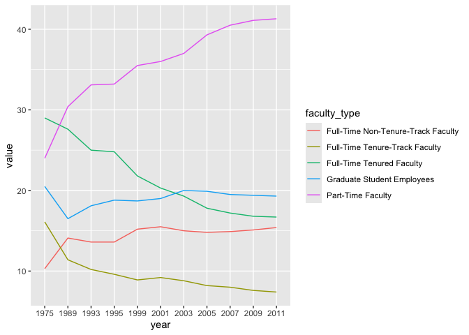
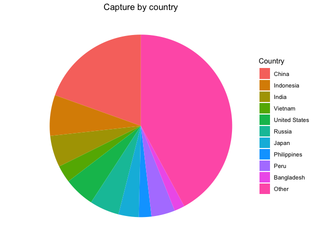
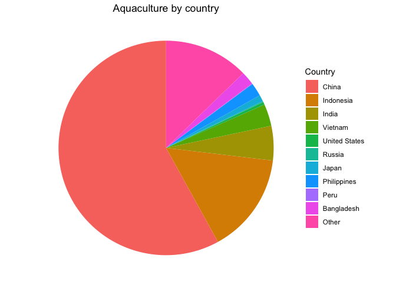

Lab 06 - Ugly charts and Simpson’s paradox
================
Insert your name here
Insert date here

### Load packages and data

``` r
library(tidyverse) 
library(dsbox)
library(mosaicData) 
```

### Exercise 1

# Data prep

``` r
staff <- read_csv("data/instructional-staff.csv")
```

    ## Rows: 5 Columns: 12
    ## ── Column specification ────────────────────────────────────────────────────────
    ## Delimiter: ","
    ## chr  (1): faculty_type
    ## dbl (11): 1975, 1989, 1993, 1995, 1999, 2001, 2003, 2005, 2007, 2009, 2011
    ## 
    ## ℹ Use `spec()` to retrieve the full column specification for this data.
    ## ℹ Specify the column types or set `show_col_types = FALSE` to quiet this message.

``` r
staff_long <- staff %>%
  pivot_longer(cols = -faculty_type, names_to = "year") %>%
  mutate(value = as.numeric(value))

staff_long
```

    ## # A tibble: 55 × 3
    ##    faculty_type              year  value
    ##    <chr>                     <chr> <dbl>
    ##  1 Full-Time Tenured Faculty 1975   29  
    ##  2 Full-Time Tenured Faculty 1989   27.6
    ##  3 Full-Time Tenured Faculty 1993   25  
    ##  4 Full-Time Tenured Faculty 1995   24.8
    ##  5 Full-Time Tenured Faculty 1999   21.8
    ##  6 Full-Time Tenured Faculty 2001   20.3
    ##  7 Full-Time Tenured Faculty 2003   19.3
    ##  8 Full-Time Tenured Faculty 2005   17.8
    ##  9 Full-Time Tenured Faculty 2007   17.2
    ## 10 Full-Time Tenured Faculty 2009   16.8
    ## # ℹ 45 more rows

``` r
staff_long %>%
  ggplot(aes(x = year, y = value, color = faculty_type)) +
  geom_line()
```

    ## `geom_line()`: Each group consists of only one observation.
    ## ℹ Do you need to adjust the group aesthetic?

<!-- -->

# An early attempt

``` r
staff_long %>%
  ggplot(aes(
    x = year,
    y = value,
    group = faculty_type,
    color = faculty_type
  )) +
  geom_line()
```

<!-- -->

# Fix the plot

``` r
staff_plot <- 
  ggplot(staff_long, aes(
    x = year,
    y = value,
    group = faculty_type,
    color = faculty_type
  )) +
  labs(title = "Instructional Staff Employment Trends", x = "Year", y = "Percentage", color = "Faculty Type") +
  theme(plot.title = element_text(hjust = 0.5)) +
  geom_line()

ggsave(staff_plot, file="staff_plot.pdf", width = 12, height = 4)
```

### Exercise 2

``` r
part_time_staff <- staff[4, ] %>%
  pivot_longer(cols = -faculty_type, names_to = "year") %>%
  mutate(value = as.numeric(value))

part_time_staff_plot <- 
  ggplot(part_time_staff, aes(
    x = year,
    y = value,
    group = faculty_type,
    color = faculty_type
  )) +
  labs(title = "Instructional Staff Employment Trends", x = "Year", y = "Percentage", color = "Faculty Type") +
  theme(plot.title = element_text(hjust = 0.5)) +
  geom_line()

ggsave(part_time_staff_plot, file="part_time_staff_plot.pdf", width = 12, height = 4)
```

### Exercise 3

My idea is to onlt visualize the 10 most productive countries and lable
the rest as others.

``` r
fisheries <- read_csv("data/fisheries.csv")
```

    ## Rows: 216 Columns: 4
    ## ── Column specification ────────────────────────────────────────────────────────
    ## Delimiter: ","
    ## chr (1): country
    ## dbl (3): capture, aquaculture, total
    ## 
    ## ℹ Use `spec()` to retrieve the full column specification for this data.
    ## ℹ Specify the column types or set `show_col_types = FALSE` to quiet this message.

``` r
fisheries <- fisheries %>% 
  arrange(desc(total))

other_capture <- sum(fisheries$capture[-(1:10)])
other_aquaculture <- sum(fisheries$aquaculture[-(1:10)])
other_total <- other_capture + other_aquaculture

fisheries_1 <- fisheries %>% 
  slice(1:10) %>% 
  #add_row(country = "Other", capture = other_capture, aquaculture = other_aquaculture, total = other_total) %>% 
  mutate(country = factor(country, levels = unique(country))) %>% 
  pivot_longer(cols = -country,
               names_to = "type",
               values_to = "value")
  

fisheries_line <- ggplot(fisheries_1, aes(x = country,
                      y = value,
                      color = type,
                      group = type)) +
  geom_line() +
  geom_point() +
  labs(title = "Countries with highest production", x = "Country", y = "Production", color = "Type") +
  theme(plot.title = element_text(hjust = 0.5))

ggsave(fisheries_line, file="fisheries_line.pdf", width = 12, height = 4)

fisheries_2 <- fisheries %>% 
  slice(1:10) %>% 
  add_row(country = "Other", capture = other_capture, aquaculture = other_aquaculture, total = other_total) %>% 
  mutate(country = factor(country, levels = unique(country))) 

ggplot(fisheries_2, aes(x = "", y = capture, fill = country)) +
  geom_col(width = 1) +
  coord_polar(theta = "y") +
  theme_void() +
  labs(title = "Capture by country", fill = "Country") +
  theme(plot.title = element_text(hjust = 0.5))
```

<!-- -->

``` r
ggplot(fisheries_2, aes(x = "", y = aquaculture, fill = country)) +
  geom_col(width = 1) +
  coord_polar(theta = "y") +
  theme_void() +
  labs(title = "Aquaculture by country", fill = "Country") +
  theme(plot.title = element_text(hjust = 0.5))
```

<!-- -->
