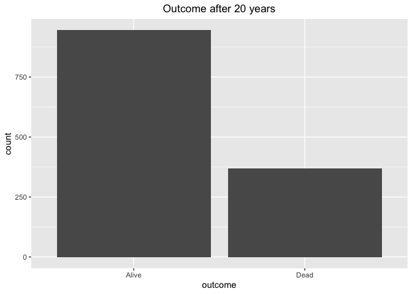
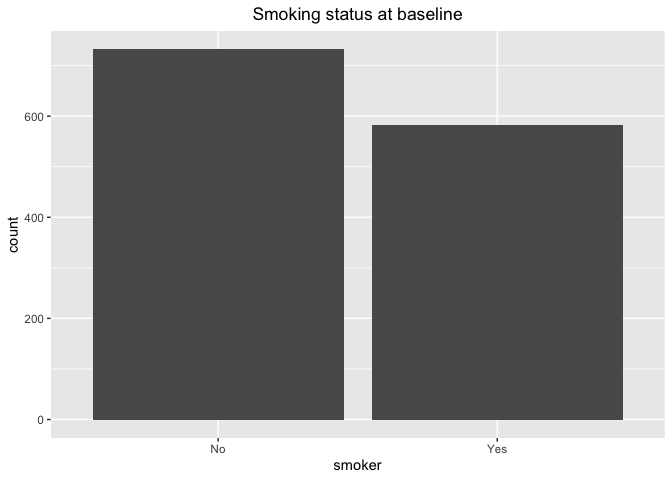
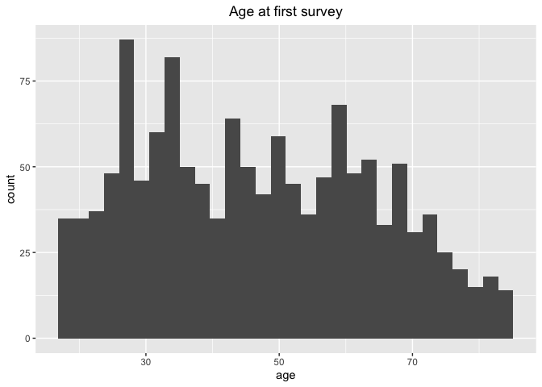
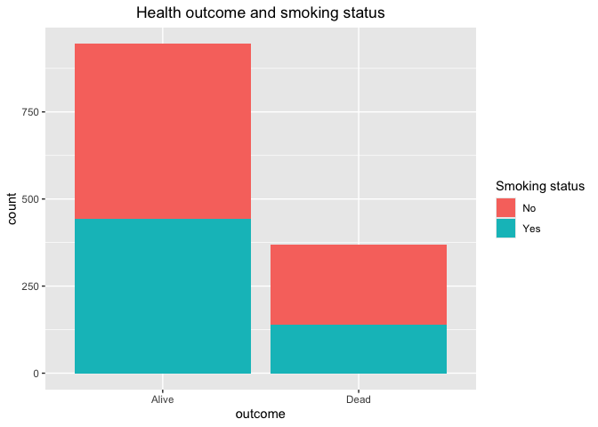

Lab 06 - Ugly charts and Simpson’s paradox
================
Insert your name here
Insert date here

### Load packages and data

``` r
library(tidyverse) 
library(dsbox)
library(mosaicData) 
library(performance)
```

### Exercise 1

# Data prep

``` r
staff <- read_csv("data/instructional-staff.csv")
```

    ## Rows: 5 Columns: 12
    ## ── Column specification ────────────────────────────────────────────────────────
    ## Delimiter: ","
    ## chr  (1): faculty_type
    ## dbl (11): 1975, 1989, 1993, 1995, 1999, 2001, 2003, 2005, 2007, 2009, 2011
    ## 
    ## ℹ Use `spec()` to retrieve the full column specification for this data.
    ## ℹ Specify the column types or set `show_col_types = FALSE` to quiet this message.

``` r
staff_long <- staff %>%
  pivot_longer(cols = -faculty_type, names_to = "year") %>%
  mutate(value = as.numeric(value))

staff_long
```

    ## # A tibble: 55 × 3
    ##    faculty_type              year  value
    ##    <chr>                     <chr> <dbl>
    ##  1 Full-Time Tenured Faculty 1975   29  
    ##  2 Full-Time Tenured Faculty 1989   27.6
    ##  3 Full-Time Tenured Faculty 1993   25  
    ##  4 Full-Time Tenured Faculty 1995   24.8
    ##  5 Full-Time Tenured Faculty 1999   21.8
    ##  6 Full-Time Tenured Faculty 2001   20.3
    ##  7 Full-Time Tenured Faculty 2003   19.3
    ##  8 Full-Time Tenured Faculty 2005   17.8
    ##  9 Full-Time Tenured Faculty 2007   17.2
    ## 10 Full-Time Tenured Faculty 2009   16.8
    ## # ℹ 45 more rows

``` r
staff_long %>%
  ggplot(aes(x = year, y = value, color = faculty_type)) +
  geom_line()
```

    ## `geom_line()`: Each group consists of only one observation.
    ## ℹ Do you need to adjust the group aesthetic?

<!-- -->

# An early attempt

``` r
staff_long %>%
  ggplot(aes(
    x = year,
    y = value,
    group = faculty_type,
    color = faculty_type
  )) +
  geom_line()
```

<!-- -->

# Fix the plot

``` r
staff_plot <- 
  ggplot(staff_long, aes(
    x = year,
    y = value,
    group = faculty_type,
    color = faculty_type
  )) +
  labs(title = "Instructional Staff Employment Trends", x = "Year", y = "Percentage", color = "Faculty Type") +
  theme(plot.title = element_text(hjust = 0.5)) +
  geom_line()

ggsave(staff_plot, file="staff_plot.pdf", width = 12, height = 4)
```

### Exercise 2

A reasonable change would be showing how the percentage of part-time
faculty member has changed over time. That is, adding an axis of years.

``` r
part_time_staff <- staff[4, ] %>%
  pivot_longer(cols = -faculty_type, names_to = "year") %>%
  mutate(value = as.numeric(value))

part_time_staff_plot <- 
  ggplot(part_time_staff, aes(
    x = year,
    y = value,
    group = faculty_type,
    color = faculty_type
  )) +
  labs(title = "Instructional Staff Employment Trends", x = "Year", y = "Percentage", color = "Faculty Type") +
  theme(plot.title = element_text(hjust = 0.5)) +
  geom_line()

ggsave(part_time_staff_plot, file="part_time_staff_plot.pdf", width = 12, height = 4)
```

### Exercise 3

My idea is to onlt visualize the 10 most productive countries and lable
the rest as others.

``` r
fisheries <- read_csv("data/fisheries.csv")
```

    ## Rows: 216 Columns: 4
    ## ── Column specification ────────────────────────────────────────────────────────
    ## Delimiter: ","
    ## chr (1): country
    ## dbl (3): capture, aquaculture, total
    ## 
    ## ℹ Use `spec()` to retrieve the full column specification for this data.
    ## ℹ Specify the column types or set `show_col_types = FALSE` to quiet this message.

``` r
fisheries <- fisheries %>% 
  arrange(desc(total))

other_capture <- sum(fisheries$capture[-(1:10)])
other_aquaculture <- sum(fisheries$aquaculture[-(1:10)])
other_total <- other_capture + other_aquaculture

fisheries_1 <- fisheries %>% 
  slice(1:10) %>% 
  #add_row(country = "Other", capture = other_capture, aquaculture = other_aquaculture, total = other_total) %>% 
  mutate(country = factor(country, levels = unique(country))) %>% 
  pivot_longer(cols = -country,
               names_to = "type",
               values_to = "value")
  

fisheries_line <- ggplot(fisheries_1, aes(x = country,
                      y = value,
                      color = type,
                      group = type)) +
  geom_line() +
  geom_point() +
  labs(title = "Countries with highest production", x = "Country", y = "Production", color = "Type") +
  theme(plot.title = element_text(hjust = 0.5))

ggsave(fisheries_line, file="fisheries_line.pdf", width = 12, height = 4)

fisheries_2 <- fisheries %>% 
  slice(1:10) %>% 
  add_row(country = "Other", capture = other_capture, aquaculture = other_aquaculture, total = other_total) %>% 
  mutate(country = factor(country, levels = unique(country))) 

ggplot(fisheries_2, aes(x = "", y = capture, fill = country)) +
  geom_col(width = 1) +
  coord_polar(theta = "y") +
  theme_void() +
  labs(title = "Capture by country", fill = "Country") +
  theme(plot.title = element_text(hjust = 0.5))
```

<!-- -->

``` r
ggplot(fisheries_2, aes(x = "", y = aquaculture, fill = country)) +
  geom_col(width = 1) +
  coord_polar(theta = "y") +
  theme_void() +
  labs(title = "Aquaculture by country", fill = "Country") +
  theme(plot.title = element_text(hjust = 0.5))
```

<!-- -->

# Stretch Practice with Smokers in Whickham

### Exercise 1

The data is observational because it is very unlikely to randomly assign
people to smoking or not smoking and see how it would turn out in 20
years.

``` r
data(Whickham)

?Whickham
#performance::compare_performance() # might not be behaving as intended. Did not work.
```

### Exercise 2

There are 1,314 observations, each of which represent an individual
recorded in the study.

``` r
glimpse(Whickham)
```

    ## Rows: 1,314
    ## Columns: 3
    ## $ outcome <fct> Alive, Alive, Dead, Alive, Alive, Alive, Alive, Dead, Alive, A…
    ## $ smoker  <fct> Yes, Yes, Yes, No, No, Yes, Yes, No, No, No, No, Yes, No, Yes,…
    ## $ age     <int> 23, 18, 71, 67, 64, 38, 45, 76, 28, 27, 28, 34, 20, 72, 48, 45…

### Exercise 3

There three variables. Outcome is a categorical variable representing
whether the individual was alive after 20 years, smoker is a cateogrical
variable representing smoking status at baseline, and age is a
continuous variable representing age at the time of the first survey.

``` r
ggplot(Whickham, aes(x = outcome)) +
  geom_bar() +
  labs(title = "Outcome after 20 years") +
  theme(plot.title = element_text(hjust = 0.5))
```

<!-- -->

``` r
ggplot(Whickham, aes(x = smoker)) +
  geom_bar() +
  labs(title = "Smoking status at baseline") +
  theme(plot.title = element_text(hjust = 0.5))
```

<!-- -->

``` r
ggplot(Whickham, aes(x = age)) +
  geom_histogram() +
  labs(title = "Age at first survey") +
  theme(plot.title = element_text(hjust = 0.5))
```

    ## `stat_bin()` using `bins = 30`. Pick better value `binwidth`.

<!-- -->

### Exercise 4

Smoking status should predict bad health outcome.

### Exercise 5

The visualization does not meet my expectations because there were a
higher proportion of individuals alive among smokers.

``` r
ggplot(Whickham, aes(x = outcome, fill = smoker)) +
  geom_bar() +
  labs(title = "Health outcome and smoking status", fill = "Smoking status") +
  theme(plot.title = element_text(hjust = 0.5))
```

<!-- -->

``` r
Whickham %>%
  count(smoker, outcome)
```

    ##   smoker outcome   n
    ## 1     No   Alive 502
    ## 2     No    Dead 230
    ## 3    Yes   Alive 443
    ## 4    Yes    Dead 139

### Exercise 6

``` r
Whickham <- Whickham %>%
  mutate(age_cat = case_when(
    age <= 44 ~ "18-44",
    age > 44 & age <= 64 ~ "45-64",
    age > 64 ~ "65+"
  )) %>% 
  mutate(age_cat = as.factor(age_cat))
```

### Exercise 7

Now the relationship between smoking status and health outcome is
moderated by age group. Smoking status does not seem to have a strong
relationship between health status among individuals between 18 to 64.
But most smokers over 65 were dead. This is because age at the first
survey is a lurking variable. The harm of smoking are onset at older
ages. Therefore, younger smokers at baseline reported similar health
status as non-smoker after 20 years.

``` r
cool_plot <- ggplot(Whickham, aes(x = outcome, fill = smoker)) +
  geom_bar() +
  facet_wrap(~age_cat) +
  coord_flip()

ggsave(
  cool_plot,
  filename = "cool_plot.png",
  width = 16, height = 4, units = "in", dpi = 300
)

Whickham %>%
  count(smoker, age_cat, outcome)
```

    ##    smoker age_cat outcome   n
    ## 1      No   18-44   Alive 327
    ## 2      No   18-44    Dead  12
    ## 3      No   45-64   Alive 147
    ## 4      No   45-64    Dead  53
    ## 5      No     65+   Alive  28
    ## 6      No     65+    Dead 165
    ## 7     Yes   18-44   Alive 270
    ## 8     Yes   18-44    Dead  15
    ## 9     Yes   45-64   Alive 167
    ## 10    Yes   45-64    Dead  80
    ## 11    Yes     65+   Alive   6
    ## 12    Yes     65+    Dead  44
